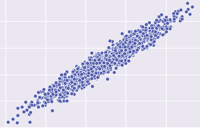

# Overview

Linear regression algorithm for predicting house prices in TensorFlow.
We train model on "USA Housing Prices Data Set".

## Info about dataset

* [USA Housing Prices Data Set](https://www.kaggle.com/aariyan101/usa-housingcsv)

### Linear regression algorithm

## Requirements

* [TensorFlow](https://www.tensorflow.org) - Deep learning framework
* [Numpy](http://www.numpy.org) - Package for scientific computing
* [Pandas](https://pandas.pydata.org) - Data analysis library
* [Seaborn](https://seaborn.pydata.org) - Data visualization library based on matplotlib
* [Matplotlib](https://matplotlib.org) - Plotting library
* [Scikit-Learn](https://scikit-learn.org/stable/) - Data mining and data analysis library

## Author

* **Przemysław Kanach** - [Przemysław Kanach](https://github.com/Przemoo16)
